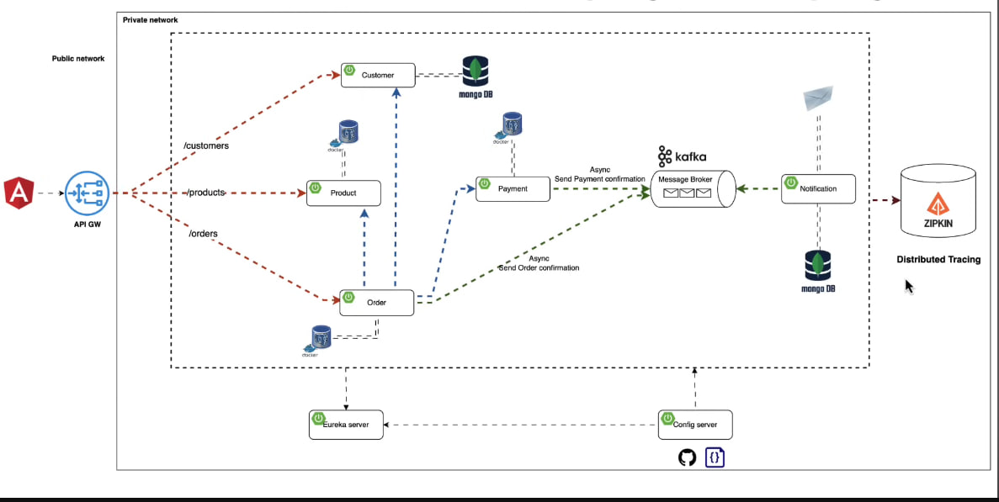

# CLAUDE.md

This file provides guidance to Claude Code (claude.ai/code) when working with code in this repository.

## Developer Profile

Backend developer with 20 years of experience who consistently writes testable, readable code using modern clean code approaches. Prioritizes quality over speed and never compromises when choosing between high-quality and fast implementations.

## Project Overview

Spring Boot microservices e-commerce application using Spring Cloud 2025.1.0 and Java 21. Services communicate via REST, use Netflix Eureka for service discovery, and Spring Cloud Config Server for centralized configuration.

## Architecture

**Startup order matters** — services depend on each other:
1. `config-server` (port 8888) — must start first; all other services fetch config from it
2. `discovery-service` (port 8761) — Eureka Server; must start before business services
3. `gateway` (port 8222) — Spring Cloud Gateway; routes all external traffic to internal services
4. `customer` (port 8090) — MongoDB-backed, registers with Eureka
5. `product` (port 8050) — PostgreSQL-backed with Flyway migrations, registers with Eureka
6. `order` (port 8070) — PostgreSQL-backed, orchestrates orders via REST (customer, product, payment) and produces Kafka events
7. `payment` (port 8060) — PostgreSQL-backed, processes payments and produces Kafka events
8. `notification` (port 8040) — MongoDB-backed, consumes Kafka events and sends emails via mail-dev

**Configuration flow:** Each service bootstraps via `spring.config.import=configserver:http://localhost:8888`, then loads its `<service-name>.yml` from `services/config-server/src/main/resources/configurations/`.

**Messaging:** Kafka (port 9092, Zookeeper on 22181) for async communication:
- `order-topic` — Order Service produces `OrderConfirmation`, Notification Service consumes
- `payment-topic` — Payment Service produces `PaymentNotificationRequest`, Notification Service consumes

**Databases:**
- Customer Service → MongoDB (credentials: root/root, port 27017)
- Product Service → PostgreSQL (credentials: root/root, port 5432, db: `product`) with Flyway migrations in `services/product/src/main/resources/db/migration/`
- Order Service → PostgreSQL (credentials: root/root, port 5432, db: `order`)
- Payment Service → PostgreSQL (credentials: root/root, port 5432, db: `payment`)
- Notification Service → MongoDB (credentials: root/root, port 27017, db: `notification`)

## Build & Run

### Infrastructure (Docker)
```bash
# Start all infrastructure (PostgreSQL, MongoDB, Kafka, Zookeeper, pgAdmin, Mongo Express, mail-dev)
docker-compose up -d

# Stop
docker-compose down
```


### Build a service
```bash
mvn clean package -f services/<service-name>/pom.xml -DskipTests
# e.g.: mvn clean package -f services/customer/pom.xml -DskipTests
```

### Run a service (after building)
```bash
java -jar services/<service-name>/target/<service-name>-0.0.1-SNAPSHOT.jar
```

### Run tests
```bash
mvn test -f services/<service-name>/pom.xml
# Run a single test class:
mvn test -f services/<service-name>/pom.xml -Dtest=ClassName
```

## Code Patterns

**DTOs use Java Records** with Jakarta validation annotations (`@NotNull`, `@Email`, `@Positive`).

**REST endpoints** follow `/api/v1/<resource>` pattern.

**Error handling** uses `@RestControllerAdvice` in `GlobalExceptionHandler` per service, returning `ErrorResponse` records.

**Entity/Mapper pattern:** Entities (`@Document` for MongoDB, `@Entity` for JPA) are mapped to/from request/response records via a `*Mapper` class.

**Customer Service** uses `MongoRepository<Customer, String>` (String IDs auto-generated by MongoDB).

**Product Service** uses `JpaRepository` with Hibernate sequences (increment 50) and a custom purchase endpoint at `POST /api/v1/products/purchase` that handles inventory deduction.

**Order Service** orchestrates order creation: validates customer (via OpenFeign), purchases products (via RestTemplate), creates payment (via OpenFeign), and sends Kafka `OrderConfirmation`. Exposes `/api/v1/orders` and `/api/v1/order-lines`.

**Payment Service** processes payments and produces Kafka `PaymentNotificationRequest` to `payment-topic`. Exposes `POST /api/v1/payments`.

**Notification Service** is event-driven only (no REST endpoints). Consumes from `order-topic` and `payment-topic`, persists notifications to MongoDB, and sends HTML emails asynchronously via Thymeleaf templates (`services/notification/src/main/resources/templates/`).

**Gateway Service** is a Spring Cloud Gateway (WebMVC) that routes all `/api/v1/*` traffic to the appropriate services via Eureka load balancing. No business logic.

## Infrastructure URLs

| Service | URL |
|---------|-----|
| Config Server | http://localhost:8888 |
| Eureka Dashboard | http://localhost:8761 |
| API Gateway | http://localhost:8222 |
| pgAdmin | http://localhost:5050 |
| Mongo Express | http://localhost:8081 (credentials: root/root) |
| Mail Dev UI | http://localhost:1080 |
| Kafka | localhost:9092 |

## Resources & References

### Architecture & Diagrams


### Books & Documentation
- [Clean Code](file:///C:/Users/Andrii/Downloads/BIBLE%20-%20Clean%20Code%20-%20Robert%20Cecil%20Martin.pdf)
- [Clean Architecture](file:///C:/Users/Andrii/OneDrive%20-%20CZU%20v%20Praze/Plocha/booksmain/Clean%20Architecture%20eng.pdf)
- [Spring Fast](https://abitap.com/wp-content/uploads/2024/02/spring-b%D1%8Bstro-2023-laurenczyu-spylk%D1%8D.pdf)

### YouTube Videos
- [🚀 🔥 Mastering Microservices: Spring boot, Spring Cloud and Keycloak In 7 Hours](https://www.youtube.com/watch?v=jdeSV0GRvwI&t=6384s)